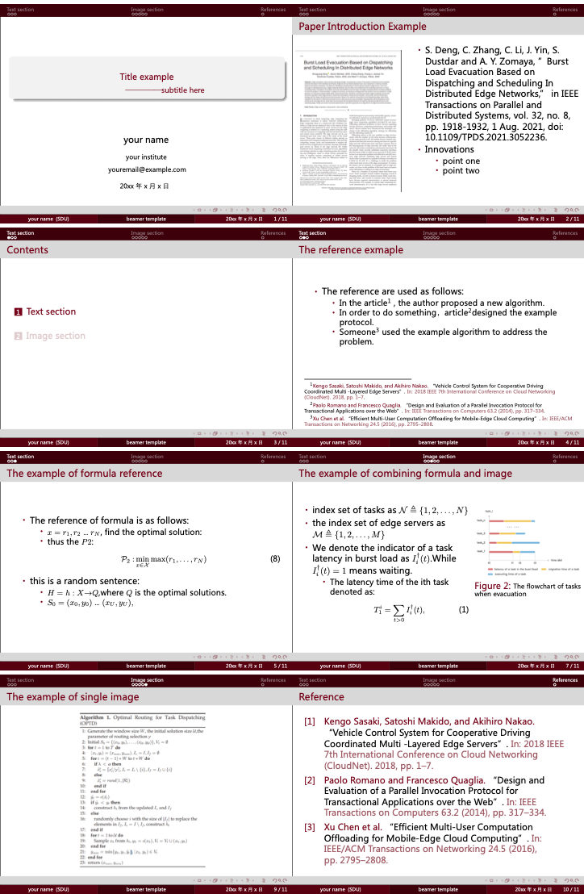

# SDU-beamer

A LaTeX Template of Beamer for Shandong University.

山东大学 Beamer 模板。

## Demo



## Usage

### Method 1: 线上环境

+ 打开 [Overleaf]() 链接

- `Open as Template`
- 编辑内容 然后保存即可自动编译

### Method 2: 本地编译

- 安装本地 TeX 环境: https://www.latex-project.org/get
- 克隆本仓库`git clone https://github.com/timerring/SDU-beamer` 或者下载本仓库。
- 修改 `main.tex`文件。
- 可采用命令行直接编译`xelatex main` 或者 在你的 tex 相关 IDE 中直接编译运行。

> 本模板仅支持 UTF-8 编码。如果你使用 tex 相关的 IDE ，强烈推荐使用 `XeLaTeX` 引擎，请自行在 TeX IDE 中切换引擎。对于其他相关引擎的支持情况未知。

本项目如用于**中文** beamer 展示，请确保以下两点：
1. 请使用 XeLaTex 引擎编译，否则会报错。
2. 文档使用的是微软雅黑以及宋体，可以按需在文档中改为指定的字体。如果想使用默认的微软雅黑以及宋体，Win 系统通常自带。但对 MacOS 及 Linux 等版本，推荐下载对应字体。请分别下载 [微软雅黑](https://github.com/chengda/popular-fonts/blob/master/%E5%BE%AE%E8%BD%AF%E9%9B%85%E9%BB%91.ttf) 并重命名为 `Microsoft YaHei.ttf` 与 [宋体](https://github.com/Haixing-Hu/latex-chinese-fonts/blob/master/chinese/%E5%AE%8B%E4%BD%93/SimSun.ttc) 字体并重名为 `simsun.ttc`。
> + 对于 MacOS，将字体文件移动至用户目录下的 `/Library/Fonts` 即可。
> + 对与 Linux 的各发行版，请自行搜索安装方法。

## File layout

+ 更多的细节内容，请根据 tex 中的注释进行修改。
+ 修改 .sty 文件中 sdured 的 rgb 参数即可改变颜色风格。
+ 修改 .sty 文件中 `png` 可以为 beamer 添加背景(正式场合不推荐使用背景)。

```
.
├── LICENSE
├── README.md
├── image // 示例图像资源
│   ├── algorithm1.png
│   ├── edge.png
│   ├── paper.png
│   ├── processing.jpg
│   ├── scheduling.jpg
│   └── tasks.png
├── main.pdf // 生成模版
├── main.tex // tex 文件
├── reference.bib // 文献引用
├── sample.png // 模版样例
└── sdubeamer.sty// 样式文件
```

## Reference

This project is based on the [Edward Hartley](http://www-control.eng.cam.ac.uk/Main/EdwardHartley)，[Nankai University beamer theme template](https://www.latexstudio.net/archives/51752.html).